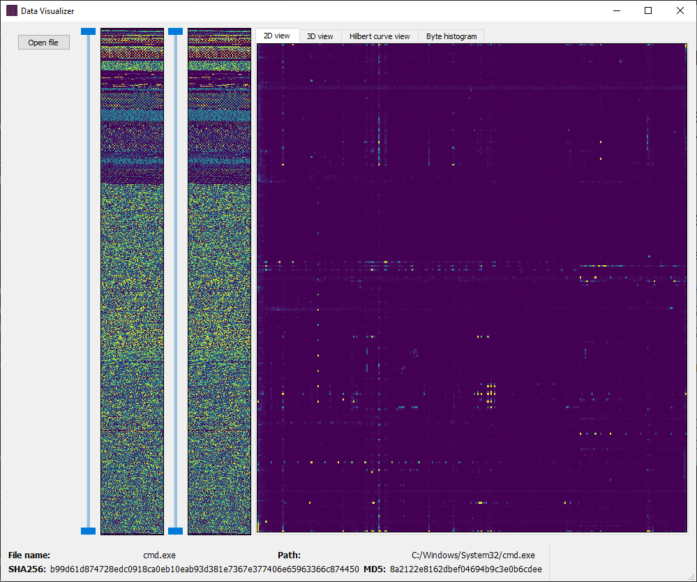
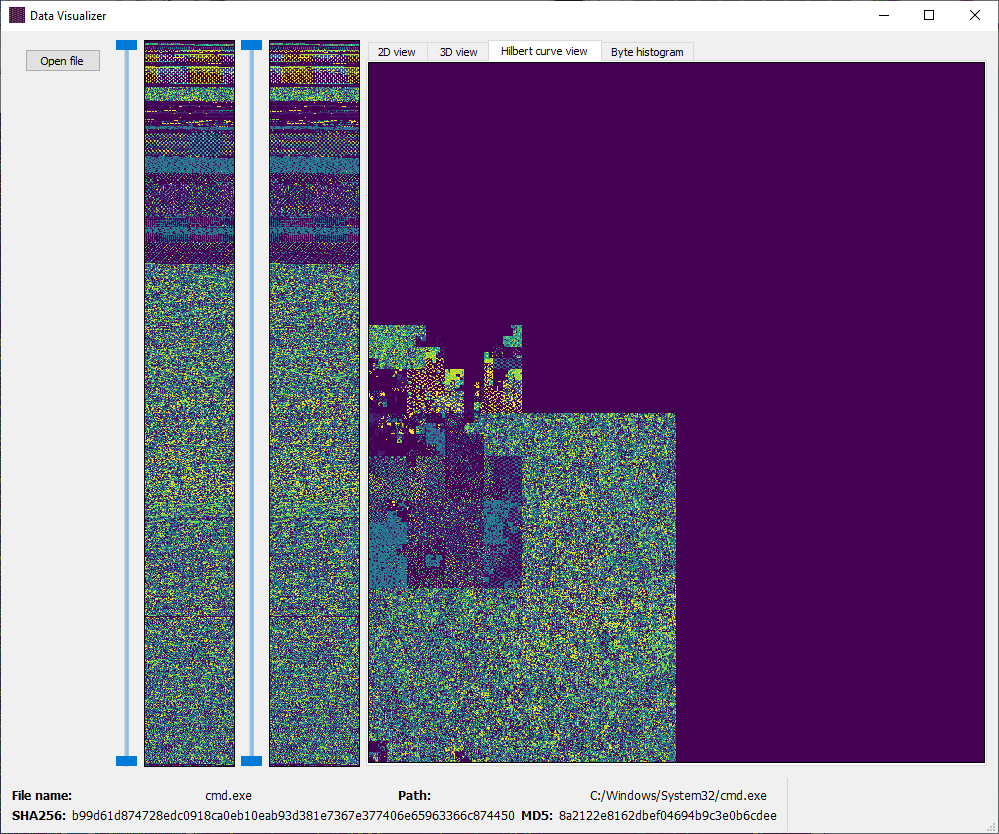

# data-visualizer

### The goal of this project is to implement similar functions to [..cantor.dust..](https://sites.google.com/site/xxcantorxdustxx/) in Python

The main GUI components are built with [PyQt5](https://pypi.org/project/PyQt5/) and with [Vispy](https://vispy.org/gallery/scene/index.html)
It's running on Windows and Linux as well, and because of Vispy, the graphics performance is great because of the GPU utilization

### Features
**Done:**
- Heatmap display of byteplots of the file for range selection
- 2D digraph heatmap represenation of file
- 2D Hilbert curve representation of 

**Planned:**
- implement range selection with range slider widget
- 3D digraph display of selected section
- 3D Hilbert curve display of selected section
- Histogram display of selected section
- Hex location selection by mouse
- Change display type selection (heatmap colors etc.)
- Improve load performance and memory management
- Byteplot display with arbitrary width

#### Screenshots (may be old)

### Links

**Related links**

[Derbycon 2012 talk that inspired this project](https://www.youtube.com/watch?v=4bM3Gut1hIk)

[Open source publication article](https://inside.battelle.org/blog-details/battelle-publishes-open-source-binary-visualization-tool)

[Original Github release (note, that this is not what was demoed, it's a Ghidra )](https://github.com/Battelle/cantordust)

**Papers, concepts and useful stuff**

[https://corte.si/posts/visualisation/entropy/index.html](https://corte.si/posts/visualisation/entropy/index.html)

[https://inside.battelle.org/blog-details/battelle-publishes-open-source-binary-visualization-tool](https://inside.battelle.org/blog-details/battelle-publishes-open-source-binary-visualization-tool)

[https://github.com/Battelle/cantordust](https://github.com/Battelle/cantordust)

[https://gynvael.coldwind.pl/?id=199](https://gynvael.coldwind.pl/?id=199)

[http://vigir.missouri.edu/~gdesouza/Research/Conference_CDs/IEEE_WCCI_2020/CEC/Papers/E-24183.pdf](http://vigir.missouri.edu/~gdesouza/Research/Conference_CDs/IEEE_WCCI_2020/CEC/Papers/E-24183.pdf)

[https://www.sciencedirect.com/science/article/pii/S0167404822000591](https://www.sciencedirect.com/science/article/pii/S0167404822000591)

[https://wiki.python.org/moin/PyQt/Creating%20a%20widget%20with%20a%20fixed%20aspect%20ratio](https://wiki.python.org/moin/PyQt/Creating%20a%20widget%20with%20a%20fixed%20aspect%20ratio)
